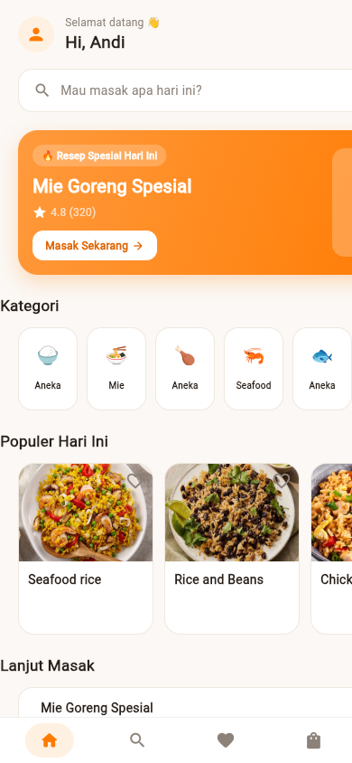

# ResepKu 🍜

Aplikasi resep masakan — cari, masak, dan belanja bahan favoritmu.
Flutter (Android + Web), oranye hangat, trilingual: **ខ្មែរ (default) · English · Bahasa Indonesia**.



## Fitur

- **Beranda** — sapaan, banner "Resep Spesial Hari Ini", kategori, resep populer, lanjut masak
- **Cari** — pencarian teks + grid 8 kategori (Aneka Nasi, Mie & Pasta, Aneka Ayam, Seafood, Ikan, Pencuci Mulut, Sayur, Minuman)
- **Detail Resep** — rating, waktu, tingkat kesulitan, porsi, gizi (kkal/karbo/protein/lemak), tab *Bahan & Bumbu*, *Langkah Memasak*, *Nutrisi*, *Penilaian*
- **Favorit** — simpan resep dengan ikon hati, filter Mudah/Sedang/Pedas
- **Daftar Belanja** — ceklis bahan dari halaman resep, progres belanja
- **Akun** — profil, statistik, progres mingguan, **pemilih bahasa (ខ្មែរ / English / Bahasa Indonesia)**, pengaturan

## Sumber data

Resep & foto: [TheMealDB](https://www.themealdb.com/) — API gratis tanpa key.
Resep unggulan (Mie Goreng Spesial) dibuat manual (`lib/models/featured.dart`).

## Menjalankan

```bash
flutter pub get
flutter run -d chrome        # web
flutter run                  # perangkat Android
flutter test                 # smoke test
```

## Bahasa (i18n)

Seluruh antarmuka dapat diganti tanpa rebuild: **ភាសាខ្មែរ** (default), **English**, **Bahasa Indonesia** — pilih di tab **Akun → Bahasa**. Pilihan tersimpan (`shared_preferences`) dan bertahan antar sesi.

Implementasi ringan di `lib/i18n/localizations.dart` (ChangeNotifier + `context.t('key')`, ~87 string per bahasa, fallback English). Nama resep/bahan tetap dari API (TheMealDB).

## Struktur

```
lib/
  main.dart              # app shell + bottom nav (5 tab)
  theme.dart             # design tokens (oranye #FF7A00, cream #FBF8F5)
  i18n/localizations.dart # 3 bahasa + pemilih + persistensi
  models/meal.dart       # Meal, Ingredient, AppCategory
  models/featured.dart   # resep unggulan hand-crafted
  state/app_state.dart   # favorites, shopping list, API client
  widgets/common.dart    # kartu resep, tombol favorit
  screens/home_screen.dart        # Beranda
  screens/search_screen.dart      # Cari + kategori
  screens/detail_screen.dart      # Detail 4-tab
  screens/favorites_screen.dart   # Favorit
  screens/shopping_screen.dart    # Daftar Belanja
  screens/account_screen.dart     # Akun + Pengaturan
```

## Roadmap

- [ ] Persistensi favorit & daftar belanja (shared_preferences)
- [ ] Resep Indonesia asli (TheMealDB minim untuk Nusantara)
- [ ] Filter pencarian (waktu, tingkat, porsi)
- [ ] Dark mode
- [ ] Build release APK

## Kredit

UI design pattern: [abuanwar072/Recipe-App-Flutter-UI](https://github.com/abuanwar072/Recipe-App---Flutter-UI).
Logo & branding: ResepKu (Sastra Digital Innovation).
